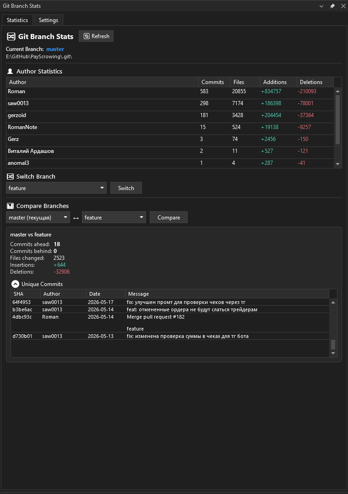
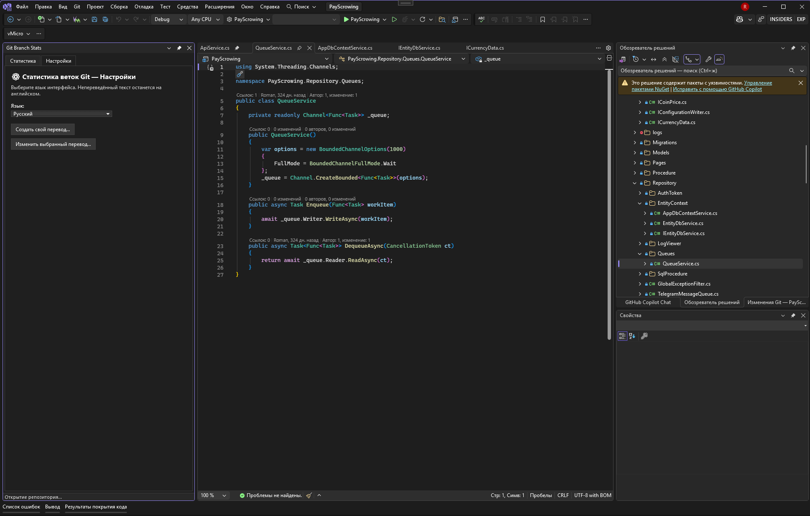

<div align="center">


# Git Branch Stats

**Git branch statistics inside Visual Studio** — author activity, branch switching,
and branch comparison in a themed, localizable tool window.

<a href="https://marketplace.visualstudio.com/items?itemName=GitBrachStatistic.GitBranchStats">
  
</a>

<br/><br/>

[](https://github.com/anomal3/GitBranchStats/actions/workflows/build.yml)
[](https://marketplace.visualstudio.com/items?itemName=GitBrachStatistic.GitBranchStats)
[](https://marketplace.visualstudio.com/items?itemName=GitBrachStatistic.GitBranchStats)
[](https://marketplace.visualstudio.com/items?itemName=GitBrachStatistic.GitBranchStats)

</div>

---

## Overview

**Git Branch Stats** adds a dockable tool window to Visual Studio that gives you an
at-a-glance view of the Git repository behind your current solution: who committed
what, how branches differ, and quick branch switching — without leaving the IDE.

## Screenshots

### Statistics, branch switching & comparison



### Settings tab (language & custom translations) inside Visual Studio



## Features

- **Author statistics** — commits, files changed, and lines added/deleted per
  author for the current branch.
- **Branch switching** — check out any local branch directly from the tool window.
- **Branch comparison** — commits ahead/behind, changed files, insertions and
  deletions, plus the list of unique commits between two branches.
- **Localization** — switch the interface between **English** and **Russian**, or
  create your **own translation** right in the *Settings* tab. Untranslated text
  automatically falls back to English.
- **Theme-aware** — the UI follows your active Visual Studio theme (Light, Dark,
  and Blue).
- Built on **LibGit2Sharp** — no external Git installation required.

## Usage

1. Open a solution that lives in a Git repository.
2. Open the tool window: **View → Git Branch Stats**.
3. The window reads the solution's repository and shows the statistics.
4. Use the **Settings** tab to change the language or add a custom translation.

### Custom translations

In **Settings → Create your own translation…** you get a table of every English
string with a field for your translation. Save it with a name and it becomes a new,
selectable language. Anything you leave blank stays in English.

## Requirements

- Visual Studio 2022 or newer
- A solution stored in a Git repository

## Installation

Install from the [**Visual Studio Marketplace**](https://marketplace.visualstudio.com/items?itemName=GitBrachStatistic.GitBranchStats),
or download `GitBranchStats.vsix` from the [latest release](https://github.com/anomal3/GitBranchStats/releases/latest)
and double-click it to install.

## Building from source

A PowerShell build script is included. From the repository root:

```powershell
.\build.ps1                       # Release build → Build\GitBranchStats.vsix
.\build.ps1 -Configuration Debug  # Debug build
```

The script locates MSBuild via `vswhere`, restores and builds the project, and
copies the resulting `.vsix` into the `Build` folder.

### Project structure

| Project                 | Description                                              |
| ----------------------- | -------------------------------------------------------- |
| `GitBranchStats`        | VSPackage / VSIX — tool window registration and commands |
| `GitBranchStats.Core`   | Models, services (LibGit2Sharp), view models, localization |
| `GitBranchStats.UI`     | WPF views, themed controls, translation editor           |
| `GitBranchStats.Tests`  | Unit tests                                               |
