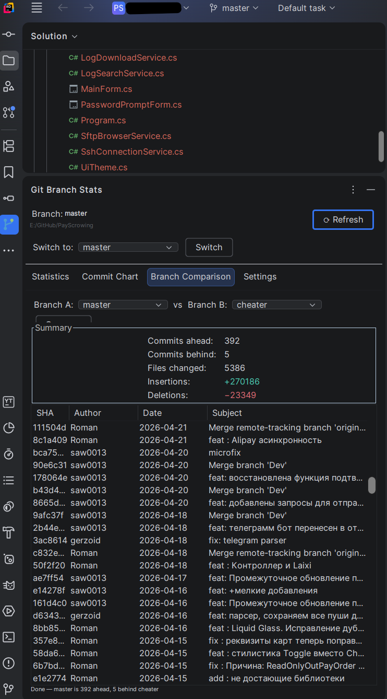
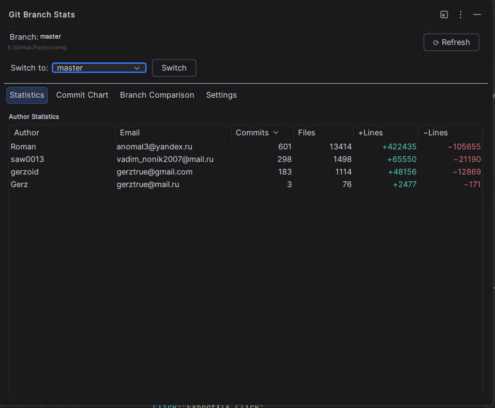

<div align="center">


# Git Branch Stats

**Git branch statistics inside your IDE** — author activity, commit timeline charts,
branch switching, and branch comparison in a themed, localizable tool window.

<a href="https://marketplace.visualstudio.com/items?itemName=GitBrachStatistic.GitBranchStats">
  
</a>
&nbsp;
<a href="https://plugins.jetbrains.com/plugin/com.gitbranchstats">
  
</a>

<br/><br/>

[](https://github.com/anomal3/GitBranchStats/actions/workflows/build.yml)
[](https://marketplace.visualstudio.com/items?itemName=GitBrachStatistic.GitBranchStats)
[](https://marketplace.visualstudio.com/items?itemName=GitBrachStatistic.GitBranchStats)
[](https://marketplace.visualstudio.com/items?itemName=GitBrachStatistic.GitBranchStats)

</div>

---

## Overview

**Git Branch Stats** adds a dockable tool window to your IDE that gives you an
at-a-glance view of the Git repository: who committed what, how branches differ,
and quick branch switching — without leaving the IDE.

Available for **Visual Studio 2022** and **JetBrains Rider 2025.3+**.

## Screenshots

### Visual Studio

#### Statistics, branch switching & comparison


#### Settings tab (language & custom translations)


### JetBrains Rider

#### Statistics, commit timeline chart & branch comparison



#### Settings tab (language & custom translations)



## Features

- **Author statistics** — commits, files changed, and lines added/deleted per
  author for the current branch.
- **Commit timeline chart** *(Rider)* — smooth day-by-day chart showing who
  committed when, with per-author colors.
- **Branch switching** — check out any local branch directly from the tool window.
- **Branch comparison** — commits ahead/behind, changed files, insertions and
  deletions, plus the list of unique commits between two branches.
- **Localization** — switch the interface between **English** and **Russian**, or
  create your **own translation** right in the *Settings* tab. Untranslated text
  automatically falls back to English.
- **Theme-aware** — the UI follows your active IDE theme (Light / Dark).

## Installation

### Visual Studio

Install from the [**Visual Studio Marketplace**](https://marketplace.visualstudio.com/items?itemName=GitBrachStatistic.GitBranchStats),
or download `GitBranchStats.vsix` from the [latest release](https://github.com/anomal3/GitBranchStats/releases/latest)
and double-click it to install.

**Requirements:** Visual Studio 2022 or newer · A solution in a Git repository

### JetBrains Rider

Install from the [**JetBrains Marketplace**](https://plugins.jetbrains.com/plugin/com.gitbranchstats):
**Settings → Plugins → Marketplace** → search *Git Branch Stats* → Install.

Or install manually: download the `.zip` from [Releases](https://github.com/anomal3/GitBranchStats/releases/latest)
and use **Settings → Plugins → ⚙ → Install Plugin from Disk**.

**Requirements:** JetBrains Rider 2025.3 or newer · A project in a Git repository

## Usage

1. Open a project/solution that lives in a Git repository.
2. Open the tool window:
   - **Visual Studio:** View → Git Branch Stats
   - **Rider:** click the Git Branch Stats icon in the right-side tool window stripe
3. The window reads the repository and shows author statistics automatically.
4. Use the **Settings** tab to change the language or add a custom translation.

### Custom translations

In the **Settings** tab you get a table of every English string with a field for
your translation. Save it with a name and it becomes a new selectable language.
Anything you leave blank stays in English.

## Building from source

### Visual Studio plugin

```powershell
.\build.ps1                       # Release build → Build\GitBranchStats.vsix
.\build.ps1 -Configuration Debug  # Debug build
```

### Rider plugin

```powershell
cd RiderGitStats
.\build.ps1                       # Release build → Build\RiderGitStats-x.x.x.zip
.\build.ps1 -Task runIde          # Launch sandbox Rider with plugin loaded
```

## Project structure

| Path | Description |
| ---- | ----------- |
| `GitBranchStats/` | Visual Studio VSIX extension (C#, WPF, LibGit2Sharp) |
| `RiderGitStats/` | JetBrains Rider plugin (Kotlin, IntelliJ Platform SDK) |
| `screenshoot/` | Screenshots used in this README |
